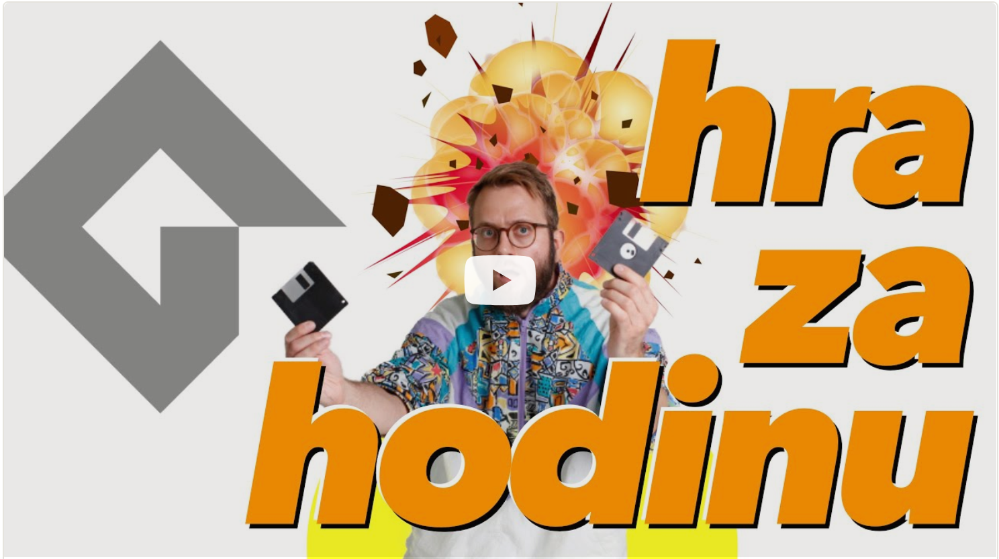

# Sprav HRU za HODINU v GameMaker Studio 2 (kurz)

**Naučím ťa GameMaker Studio 2.** Nástroj (engine) na tvorbu hier, v ktorom vznikla kopa tvojich obľúbených 2D hitov. 
Undertale, Hotline Miami, Nuclear Throne, Hyper Light Drifter... Vyrobím v ňom hru. Za hodinu aj kúsok. A počas toho ti vysvetlím základy. 
Toľko, že v pohodičke naskočíš do game dev sveta. Pozri si aj [môj predošlý kurz](https://github.com/yablko/not-so-solid-snake/), kde spravím hru len s textovým editorom, bez enginu.

Ak sa ti kurz páči, kúp mi 2-3 kávy cez PATREON ♥️ https://www.patreon.com/yablko.  
A dostaneš ďalšie kurzy skôr. Aj v textovej podobe.  

---

### Rob HRY v GameMaker Studio 2, kurz zdarma  
:: https://youtu.be/wwFC-BRKTr4 _(1h 16min 35s)_

🎧 A VŠETCI POVINNE vypočuť tento BANGER  
:: https://soundcloud.com/vasho-p/vasho-p-ak-nie-si-moja-2

---

Ak si učiteľ, môžeš tento kód a video používať na škole, ako len chceš. Enjoy!  
Ak ma chceš podporiť, a nemusíš byť učiteľ, **kúp mi 2-3 kávy cez ♥️ [patreon](https://www.patreon.com/yablko)**.  
Sľubujem, že to možno nie je kult a patróni majú moje videá a kurzy skôr. A môžu mi kydať do vecí. A dávam im tipy, rady, odporúčania, backstage veci a spomínal som, že to možno nie je kult? 

---

GameMaker Studio  
https://www.yoyogames.com  
https://www.yoyogames.com/gamemaker  
  
What Are Sprites And How They Work In Games?   
https://gamingshift.com/sprites-in-games  

Vasho P - Ak nie si moja (EGA Ultrapop Mix)  
https://soundcloud.com/vasho-p/vasho-p-ak-nie-si-moja-2  
  
Space Rocks - Full Series (GML)  
https://www.youtube.com/playlist?list=PLhIbBGhnxj5JcbfoxS_CWTnImRL_wB_Wg  
  
Zvuky a hudba (vyrob si vlastné)  
https://bfxr.net  
https://boscaceoil.net  
https://www.beepbox.co  
  
Screenshake a "Game Feel" videá  
https://www.youtube.com/watch?v=AJdEqssNZ-U  
https://www.youtube.com/watch?v=216_5nu4aVQ  
https://www.youtube.com/watch?v=Fy0aCDmgnxg  
    
Juicy Screenshake (GML)  
https://www.yoyogames.com/blog/586/coffee-break-tutorials-juicy-screenshake-gml  

---

### Chceš sa zlepšiť?  

Chyť môj kód a vylepši ho. Pár nápadov:
  
**a) OVLÁDANIE**
  
Pridaj WASD a ovládanie ovládačom.  
Zmeň direction na enum? Ak chceš.  
  
**b) SCREENS**  
  
Pridaj welcome screen, game over screen, win screen.    
Môžeš na ne použiť rooms a prepínať sa medzi nimi.  
  
**c) POSTUPNÁ OBTIAŽNOSŤ**  
  
Hra začne pomalšia. Čím väčšie score, tým rýchlejšie beží.  
Zahraj sa na game designéra a nájdi správnu obtiažnosť.  
  
**d) PARTICLES**  
  
Keď zješ jedlo, vyletia particles.  
Na pozícii hada vzniknú hviezdičky / drobné čiastočky.  
Náhodné množstvo a vyletia náhodným smerom.  
Postupne zmiznú. 

---

❤️ PATREON https://patreon.com/yablko  
🎬 YOUTUBE 2 https://youtube.com/yablko  
🍿 TWITCH https://twitch.com/yablko_  
📸 INSTAGRAM https://instagram.com/yablko  
👍 FACEBOOK https://www.facebook.com/yablko.smrdi  
🐦 TWITTER https://twitter.com/yablko  
📚 BLOGY https://medium.com/@yablko  
  
📚 Všetky moje learn2code kurzy  
:: https://www.learn2code.sk/instruktori/roman-hraska 1300+ videí
